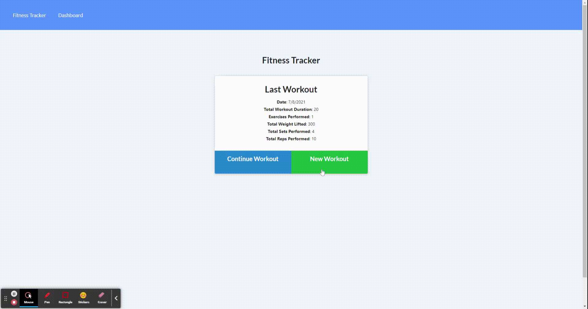

# Weightlifting/Cardio Workout Tracker

## Overview

In this exercise, the user uses a NoSQL database, specifically, MongoDB to create an application that tracks workouts, consisting of resistance and/or cardio training over a period of a week. Given a public folder, filled with HTML, CSS, and JS, a server script, models, and router routes are needed to complete the exercise. The application is then deployed on Heroku, using MongoDB Atlas to store user data.

## Table of Contents

  - [Pseudocode](#pseudocode)
  - [Installation](#installation)
  - [Usage](#usage)
  - [Technologies Used](#technologies-used)
  - [Links](#links)
  - [Resources](#resources)

## Pseudocode

1. Setup models with appropriate property names and types.
2. Setup a server script and server routes.
3. Setup api routes to give the server functionality.
4. GET, POST, PUT methods to match the method requests in the 'api' script in public.
5. Use `aggregate` and create a pipeline that returns the value of total duration of workout, using `$sum`.

## Installation

- `npm i`

## Usage

1. `npm run seed` to seed the database.
2. `npm run start` to start the server.
3. Select the type of exercise.
4. Fill out the form with the appropriate information.
5. Submit and click on the link to track the data.
6. Preferably, data should be added once per a day.

## Technologies Used
- HTML
- CSS
- JavaScript
- Bootstrap
- Express
- Mongoose

## Links

- [Deployed Site](https://workout-tracker-huirayj.herokuapp.com/)
- [Repository](https://github.com/huirayj/workout-tracker)

## Resources

- [Mongoose](https://mongoosejs.com/docs/)
- [Aggregatation](https://masteringjs.io/tutorials/mongoose/aggregate)
- [MongoDB Atlas](https://docs.atlas.mongodb.com/)
